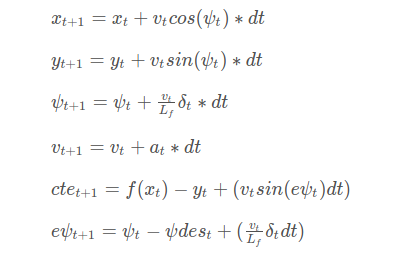

# MPC Project report
## The Model

  I implemented the model like the [lecture](https://github.com/udacity/CarND-MPC-Quizzes/blob/master/mpc_to_line/solution/MPC.cpp but with two additional cost parameters), while adding two additional cost parameters
  First, the cost is augmented with speed * (cross track error + orientation error). This is to tell the car to slow down when the car is off trajectory.
  Second, the cost is augmented with speed * (steer_angle). This is to tell the car to slow down when the car is steering, which is commen sense when driving.
  I call them "turn sensitivity" parameters. These parameters help car make sharp turns safely by regulating the relationship between the speed, steering angle and reference trajectory.
  Additionaly, the steering angle is limited between [-30, 30] in degrees.
## Timestep Length and Elapsed Duration
  I chose N = 20, dt = 0.05. Empericaly, this works best. It also divides the latency (0.1s) which serves a purpose referenced later in the report. I found that with these parameters the car reacted reasonably well to short term changes on the road and also adjust its speed accordingly for turns.
  I previously tried pairs of (N, dt): (25, 0.1), (25, 0.5), (50, 0.05).
  The first pair was okay, but I found that sometimes the car doesn't react to turns fast enough.
  The second pair was also too slow to make turns.
  The last pair took too long to compute and make the car react too slow.

## Polynomial Fitting and MPC Preprocessing
I first preprocessed the data and converted all the coordinates to the car frame of reference. So, the car is now located at (0, 0) and the heading is 0 degree. This simplifies the cte and epsi as seen on line 156 (main.cpp).
I then fitted an order 3 polynomial instead of order 1 unlike the lecture. This creates a reasonably good reference trajectory.
## Model Predictive Control with Latency
I model latency by skipping the first two actuator values (the number to skip is int(latency / elapsed duration)) as seen on line 244 (MPC.cpp)
Essentially, the model simulates the new state after a time of `latency` and use the new state as the initial state to calculate the actuator.
